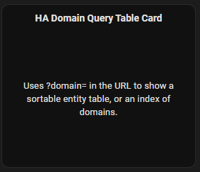
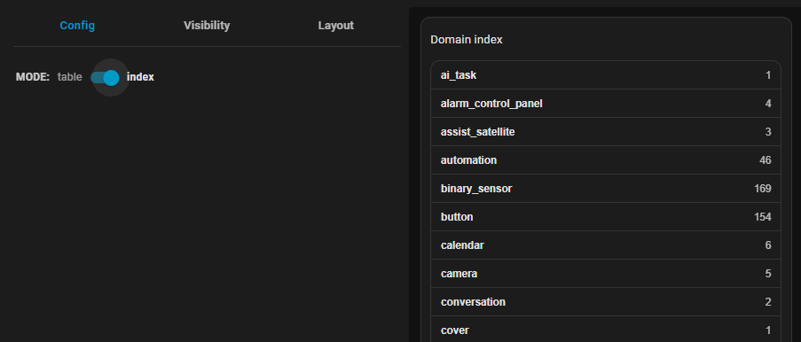
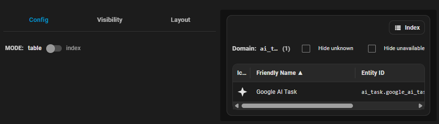

# HA Domain Query Table Card

[](https://hacs.xyz)
[](https://my.home-assistant.io/redirect/hacs_repository/?owner=YOUR_GITHUB_USERNAME&repository=ha-domain-query-table-card&category=frontend)
[](LICENSE)

A Home Assistant Lovelace custom card that uses `?domain=` in the dashboard URL to display:

- A **sortable, resizable entity table** for a domain
- Or a **domain index** with entity counts

---

## Screenshots

### Add card to dashboard


### Config – Index mode


### Config – Table mode


---

## Installation

### HACS (Recommended)

Install directly from HACS using the button below:

[](
https://my.home-assistant.io/redirect/hacs_repository/?owner=YOUR_GITHUB_USERNAME&repository=ha-domain-query-table-card&category=frontend
)

#### Manual HACS steps (optional)
1. Open **HACS**
2. Go to **Frontend**
3. Open the three-dot menu (⋮) → **Custom repositories**
4. Add:
   - **Repository**: `https://github.com/YOUR_GITHUB_USERNAME/ha-domain-query-table-card`
   - **Category**: `Frontend`
5. Install **HA Domain Query Table Card**
6. Restart Home Assistant if prompted

---

## Add the Resource (Required)

After installing with HACS, add the Lovelace resource:

[](
https://my.home-assistant.io/redirect/lovelace_resources/
)

```yaml
resources:
  - url: /hacsfiles/ha-domain-query-table-card/ha-domain-query-table-card.js
    type: module
```

---

## Manual Installation (No HACS)

1. Copy these files into your HA config:

   - `ha-domain-query-table-card.js`
   - `ha-domain-query-table-card-editor.js`

   Recommended location:
   ```
   /config/www/ha-domain-query-table-card/
   ```

2. Add the Lovelace resource:

```yaml
resources:
  - url: /local/ha-domain-query-table-card/ha-domain-query-table-card.js
    type: module
```

3. Refresh your browser.

---

## Usage

### Table Mode
```yaml
type: custom:ha-domain-query-table-card
mode: table
```

Open your dashboard with:
```
?domain=switch
```

### Index Mode
```yaml
type: custom:ha-domain-query-table-card
mode: index
```

Clicking a domain updates the URL query string.

---

## Features
- URL-driven (`?domain=`)
- Sortable columns
- Drag-to-resize columns
- Hide `unknown` / `unavailable` states
- Click entity rows for **more-info**
- UI editor support

---

## License
MIT — see [LICENSE](LICENSE)
